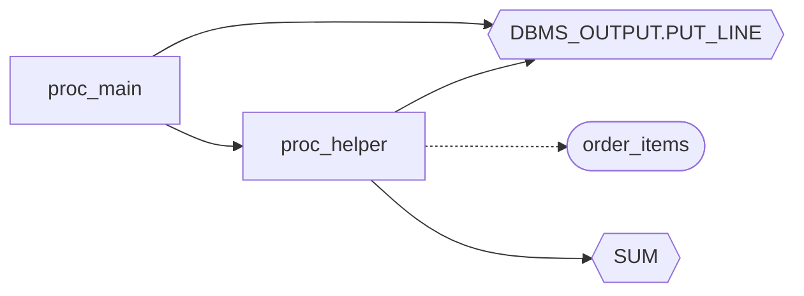

# Getting Started with codeweb

> **30 minutes to your first productivity moment.** Follow along with real commands and real output.

---

## Who this is for

Pick your track:

| You are a... | Start at | You'll need |
|---|---|---|
| **SQL/DB developer** — want to understand stored procedure call chains | §1 → §2 → §3 | A terminal and 30 minutes |
| **Full-stack Java developer** — want `Java → Mapper → SQL → Procedure` tracing | §1 → §2 → §3 (learn the tool), then jump to §4.4 | Terminal + a Java project (or follow the SQL sample first) |

Sections §5–§7 are optional "going further" — add ~30 minutes.

---

## 1. Why codeweb?

codeweb builds a **directed call graph** from your code. It answers questions that manual grepping cannot:

| Real-world problem | codeweb command |
|---|---|
| "What does this stored procedure call, and who calls it?" | `codeweb trace "proc_main"` |
| "If I change `proc_helper`, what Java APIs are affected?" | `codeweb impact --node "proc_helper"` |
| "Where exactly is `SELECT ... FROM order_items` used, across SQL files, XML mappers, and Java code?" | `codeweb trace-sql "SELECT SUM"` |

```
JavaMethod ──InvokesMapper──▶ MappedStatement ──CallsProcedure──▶ Procedure ──DirectCall──▶ Procedure
                                                                   │
                                                                   └──TableAccess──▶ Table
```

---

## 2. Installation

### From source (recommended)

```bash
git clone https://github.com/c2j/codeweb.git
cd codeweb
cargo install --path .
```

Or build without installing:

```bash
cargo build --release
# binary at target/release/codeweb
```

### Verify

```bash
codeweb --version
```

Expected: `codeweb X.Y.Z`

---

## 3. First analysis (8 minutes)

We'll create a small SQL file and build a call graph from it.

### Step 1: Create the sample

Save the following as `myapp.sql` in an empty directory:

```sql
CREATE OR REPLACE PROCEDURE proc_main(
    p_order_id IN NUMBER,
    p_status   OUT VARCHAR2
)
AS
BEGIN
    DBMS_OUTPUT.PUT_LINE('Processing order: ' || p_order_id);

    CALL proc_helper(p_order_id);

    p_status := 'PROCESSED';
END;
/

CREATE OR REPLACE PROCEDURE proc_helper(
    p_order_id IN NUMBER
)
AS
    v_total NUMBER;
BEGIN
    SELECT SUM(quantity * unit_price)
      INTO v_total
      FROM order_items
     WHERE order_id = p_order_id;

    DBMS_OUTPUT.PUT_LINE('Order ' || p_order_id || ' total: ' || v_total);
END;
/

CREATE TABLE order_items (
    order_id   NUMBER,
    item_name  VARCHAR2(200),
    quantity   NUMBER,
    unit_price NUMBER
);
```

```bash
mkdir ~/codeweb-demo
cd ~/codeweb-demo
# Save the SQL above as myapp.sql, then:
```

### Step 2: Initialize and analyze

```bash
codeweb init my-project -d .
```

Output:

```
Initialized project 'my-project' in /Users/you/codeweb-demo
full build: 1 files (0 unchanged, 0 changed, 1 added, 0 deleted) → 5 nodes, 5 edges (0.0s)
```

> **`init` is a one-time setup.** For all future updates, use `codeweb analyze` — it only re-parses changed files.

### Step 3: Check what was found

```bash
codeweb stats
```

```
Project: my-project

             2  procedures
             0  functions
             1  tables
             2  builtin functions

             5  edges
             1  files
```

```bash
codeweb nodes
```

```
TYPE               IN   OUT TOTAL  NAME
proc                0     2     2  proc:proc_main
proc                1     3     4  proc:proc_helper
table               1     0     1  table:order_items
builtin:func        2     0     2  builtin:dbms_output.put_line
builtin:func        1     0     1  builtin:sum

5 nodes
```

✅ **Success**: You see 5 nodes and 5 edges. You now have a call graph.

### Troubleshooting

| Symptom | What it means | Action |
|---|---|---|
| `proc*` tag on a node | Procedure body has unsupported syntax; signature extracted, call relationships still usable | Check `.codeweb/parse.log` for details |
| `unres` node | A called procedure/table was not found in analyzed files | Normal — codeweb marks unresolved references rather than silently dropping them |
| Chinese characters garbled | Your SQL files use GBK encoding | Add to `codeweb.toml`: `[analysis].encoding = { ".sql" = "GBK" }` |

---

## 4. Core scenarios

### 4.1 Trace call chains — "Who calls who?"

```bash
codeweb trace "proc_main"
```

```
── CALLERS ──
  (none)

── TARGET ──
  proc:proc_main

── CALLEES ──
  └── proc:proc_helper [external]
      └── table:order_items [R]
```

`proc_main` calls `proc_helper`, which reads from `order_items`. One command, full chain.

For more detail on a single node:

```bash
codeweb detail "proc_main"
```

```
══ SUMMARY ══
  proc  proc:proc_main
  in:0  out:2  total:2

── CALLERS ──
  (none)

── TARGET ──
  proc:proc_main

── CALLEES ──
  └── proc:proc_helper [external]
```

✅ **Success**: The output shows the full call chain from your target node.

### 4.2 Impact analysis — "What breaks if I change this?"

```bash
codeweb impact --node "proc_helper"
```

```json
{
  "schema_version": 2,
  "node": "proc:proc_helper",
  "upstream": [
    {
      "file_path": "/Users/you/codeweb-demo/myapp.sql",
      "symbol": "proc:proc_main",
      "line": 0
    }
  ],
  "downstream": [
    {
      "file_path": "/Users/you/codeweb-demo/myapp.sql",
      "symbol": "builtin:dbms_output.put_line",
      "line": 0
    },
    {
      "file_path": "/Users/you/codeweb-demo/myapp.sql",
      "symbol": "builtin:sum",
      "line": 0
    },
    {
      "file_path": "/Users/you/codeweb-demo/myapp.sql",
      "symbol": "table:order_items",
      "line": 21
    }
  ]
}
```

- **upstream**: Changing `proc_helper` affects `proc_main` (it calls it).
- **downstream**: `proc_helper` depends on `order_items`, `SUM`, and `DBMS_OUTPUT`.

For file-level analysis (useful in CI or code review):

```bash
codeweb impact --file src/main/java/com/example/dao/UserDao.java --format json
```

> `impact --file` shows the combined impact of every node defined in a file.

✅ **Success**: JSON output clearly separates upstream impact from downstream dependencies.

### 4.3 Search SQL fragments and trace back

Find every place a SQL pattern appears, then trace to upstream callers:

```bash
codeweb trace-sql "SELECT SUM"
```

```
SQL fragment: 'SELECT SUM'
Found 1 matching node(s)

  Procedure: proc_helper  [95%]
    file:  /Users/you/codeweb-demo/myapp.sql:21
    sql:   SELECT SUM(quantity * unit_price)
    sql:         INTO v_total
    sql:         FROM order_items [SELECT]
    sql:   ... +1 more lines
    called by:
      proc:proc_main
```

✅ **Success**: You see the full SQL snippet, the file and line where it lives, and the caller chain.

> `trace-sql` is most powerful in mixed Java+Mapper+SQL projects — search a SQL fragment and immediately see which Java method triggers it.

### 4.4 Java + MyBatis + SQL full chain (Java developers)

> If you followed §3, you already know the tool. Now apply it to a real Java project.

```bash
codeweb init my-java-app \
  -d src/main/java \
  -d src/main/resources/mapper \
  -d db/sql
```

After analysis, filter by node type:

```bash
codeweb nodes -t method      # Java methods only
codeweb nodes -t mapper      # MyBatis mapped statements only
codeweb nodes -t proc        # Stored procedures only
```

Trace end-to-end:

```bash
codeweb trace "OrderService.createOrder"
```

The output crosses all three layers — `CallsJava`, `InvokesMapper`, `CallsProcedure` edges show how a Java API method reaches the database.

✅ **Success**: `trace` output spans Java → Mapper → SQL → Procedure layers.

### 4.5 Path analysis — "How exactly does A reach Z?"

`inspect` finds all directed paths between two or more nodes. Unlike `trace` (which expands from one node), `inspect` answers: "what routes connect these specific nodes?"

```bash
codeweb inspect proc_main proc_helper --style tree
```

```
── NAME RESOLUTION ──
  "proc_main" → 1 match  (exact)
  "proc_helper" → 1 match  (exact)

── TARGET NODES ──
  proc  proc:proc_main
  proc  proc:proc_helper

── CONNECTIONS ──
  proc:proc_main → proc:proc_helper : 1 path(s)  (shortest 1 hop)

── PATHS ──
── proc:proc_helper (root, called by 1) ──
    └── proc:proc_main  ← [external]

── SUMMARY ──
  ✅ proc:proc_main → proc:proc_helper : reachable (1 hop)
```

Key options:

| Flag | Purpose |
|---|---|
| `--style tree` | Show fully expanded path tree |
| `--style summary` | Show reachability only |
| `--max-depth 15` | Limit search depth (default 15) |
| `--max-paths 10` | Limit paths per pair (default 10) |
| `--unreachable` | Also show pairs with no path |

✅ **Success**: Output shows the path(s) between your nodes with hop count and edge types.

---

## 5. Visual exploration (going further)

> **Requires** `serve` feature: `cargo build --features serve --release` (~3-5 min rebuild)

```bash
codeweb serve --open
```

This starts an HTTP server and opens an interactive Cytoscape.js graph in your browser. Drag nodes, zoom, click for properties.

✅ **Success**: Browser opens showing an interactive call graph.

> Prefer terminal? `codeweb tui` works without any feature flags. See the [User Guide §6.17](user-guide.md#617-交互式终端tui).

---

## 6. Connect AI (going further)

> **Requires** `mcp` feature: `cargo build --features mcp --release` (~3-5 min rebuild)

codeweb can run as an MCP (Model Context Protocol) server, letting LLM tools query your code graph directly.

### Setup with OpenCode

```bash
codeweb mcp --project /path/to/your/project
```

Add to your OpenCode configuration file (`.opencode/config.json` or `opencode.json`):

```json
{
  "mcpServers": {
    "codeweb": {
      "command": "/path/to/codeweb",
      "args": ["mcp", "--project", "/path/to/your/project"]
    }
  }
}
```

### Example conversation

> **You**: "Show me all stored procedures that call `pkg_order.process`"

OpenCode automatically calls the `codeweb_trace` tool and returns the call chain.

> **You**: "What Java methods ultimately invoke `pkg_order.process`?"

OpenCode chains `codeweb_query` + `codeweb_trace` to trace the full cross-language path.

### Available MCP tools

| Tool | What it does |
|---|---|
| `codeweb_stats` | Project node/edge/file counts by type |
| `codeweb_nodes` | Search, filter, and paginate nodes |
| `codeweb_node_detail` | Node properties + callers/callees |
| `codeweb_trace` | Bidirectional call chain from a node name |
| `codeweb_search_sql` | Search nodes by SQL content with scoring |
| `codeweb_query` | Execute declarative JSON QuerySpec |

✅ **Success**: Asking a question in OpenCode triggers a MCP tool call that returns accurate graph data.

---

## 7. Export and share (going further)

Export your graph for documentation, CI, or visualization tools.

```bash
codeweb export --format mermaid --output graph.mmd
```

The generated Mermaid file renders directly in GitHub/GitLab Markdown:



✅ **Success**: Pasting the `.mmd` content into a Markdown file renders a flowchart.

> DOT (Graphviz) and JSON formats available. See the [User Guide §6.11](user-guide.md#611-图谱导出export).

---

## 8. Where to go next

| You want to... | Read |
|---|---|
| Master every command and flag | [User Guide](user-guide.md) |
| Integrate via HTTP API or QuerySpec | [Developer Guide](DeveloperGuide.md) |
| See what's planned | [Roadmap](plans/roadmap.md) |
| Contribute | [Contribution Guide](../CONTRIBUTION.md) |
| Import external graph data (CGEF) | [CGEF User Guide](cgef-user-guide.md) |
