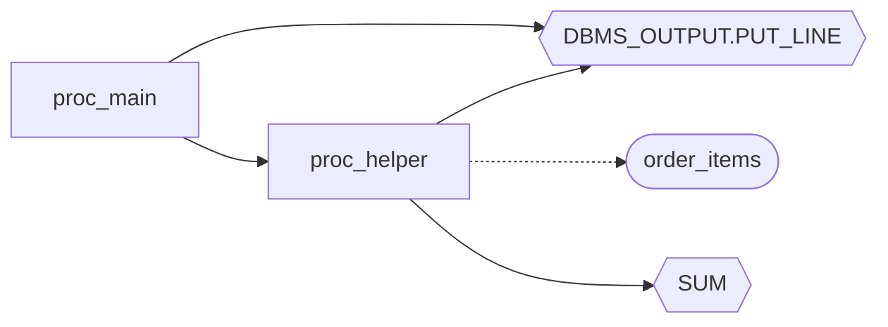

# codeweb 入门指南

> **跟着做，30 分钟从零到能用。** 每个命令都经过真实验证，输出即所见。

---

## 先看这里：选你的入口

| 你是... | 从哪开始 | 需要准备 |
|---|---|---|
| **SQL/数据库开发者** — 想理清存储过程调用关系 | §1 → §2 → §3 | 终端 + 30 分钟 |
| **全栈 Java 开发者** — 想做 `Java → Mapper → SQL → 存储过程` 全链路追踪 | §1 → §2 → §3（先熟悉工具），然后跳到 §4.4 | 终端 + Java 项目（也可以先跟 SQL 示例走一遍） |

§5–§7 是进阶内容，追加约 30 分钟。

---

## 1. codeweb 能解决什么问题？

codeweb 把你的代码解析成**有向调用图**。它能回答手动 grep 回答不了的问题：

| 真实痛点 | 一行命令解决 |
|---|---|
| "这个存储过程到底调了谁？谁又调了它？新人接手完全看不懂" | `codeweb trace "proc_main"` |
| "改 `proc_helper` 会影响哪些上游 Java 接口？不敢动" | `codeweb impact --node "proc_helper"` |
| "`SELECT ... FROM order_items` 在 SQL 文件、XML Mapper、Java 代码里哪里出现过？" | `codeweb trace-sql "SELECT SUM"` |

```
Java方法 ──InvokesMapper──▶ MappedStatement ──CallsProcedure──▶ 存储过程 ──DirectCall──▶ 存储过程
                                                                   │
                                                                   └──TableAccess──▶ 表
```

---

## 2. 安装

### 从源码安装（推荐）

```bash
git clone https://github.com/c2j/codeweb.git
cd codeweb
cargo install --path .
```

也可以只编译不安装：

```bash
cargo build --release
# 编译产物在 target/release/codeweb
```

### 验证

```bash
codeweb --version
```

应输出：`codeweb X.Y.Z`

---

## 3. 首次分析（8 分钟）

从一个简单的 SQL 文件开始，看看 codeweb 怎么建图。

### 第一步：准备示例

在一个空目录下，把以下内容保存为 `myapp.sql`：

```sql
CREATE OR REPLACE PROCEDURE proc_main(
    p_order_id IN NUMBER,
    p_status   OUT VARCHAR2
)
AS
BEGIN
    DBMS_OUTPUT.PUT_LINE('Processing order: ' || p_order_id);

    CALL proc_helper(p_order_id);

    p_status := 'PROCESSED';
END;
/

CREATE OR REPLACE PROCEDURE proc_helper(
    p_order_id IN NUMBER
)
AS
    v_total NUMBER;
BEGIN
    SELECT SUM(quantity * unit_price)
      INTO v_total
      FROM order_items
     WHERE order_id = p_order_id;

    DBMS_OUTPUT.PUT_LINE('Order ' || p_order_id || ' total: ' || v_total);
END;
/

CREATE TABLE order_items (
    order_id   NUMBER,
    item_name  VARCHAR2(200),
    quantity   NUMBER,
    unit_price NUMBER
);
```

```bash
mkdir ~/codeweb-demo
cd ~/codeweb-demo
# 把上面的 SQL 保存为 myapp.sql，然后：
```

### 第二步：初始化并分析

```bash
codeweb init my-project -d .
```

输出：

```
Initialized project 'my-project' in /Users/you/codeweb-demo
full build: 1 files (0 unchanged, 0 changed, 1 added, 0 deleted) → 5 nodes, 5 edges (0.0s)
```

> **`init` 只做一次。** 以后每次更新代码，用 `codeweb analyze` 做增量分析（只解析变更的文件）。

### 第三步：看看发现了什么

```bash
codeweb stats
```

```
Project: my-project

             2  procedures
             0  functions
             1  tables
             2  builtin functions

             5  edges
             1  files
```

```bash
codeweb nodes
```

```
TYPE               IN   OUT TOTAL  NAME
proc                0     2     2  proc:proc_main
proc                1     3     4  proc:proc_helper
table               1     0     1  table:order_items
builtin:func        2     0     2  builtin:dbms_output.put_line
builtin:func        1     0     1  builtin:sum

5 nodes
```

✅ **验证成功**：看到 5 个节点和 5 条边。你的第一张调用图已经建好了。

### 常见问题

| 现象 | 含义 | 怎么办 |
|---|---|---|
| 节点标签带 `proc*` | 存储过程 body 有不支持的语法，签名已提取，调用关系仍可用 | 查看 `.codeweb/parse.log` 了解详情 |
| 出现 `unres` 节点 | 被调用但未在分析范围内找到定义 | 正常 — codeweb 宁可标记为未解析，也不静默丢弃 |
| 中文乱码 | SQL 文件是 GBK 编码 | 在 `codeweb.toml` 加 `[analysis].encoding = { ".sql" = "GBK" }` |

---

## 4. 核心场景

### 4.1 追踪调用链 — "谁调谁？"

```bash
codeweb trace "proc_main"
```

```
── CALLERS ──
  (none)

── TARGET ──
  proc:proc_main

── CALLEES ──
  └── proc:proc_helper [external]
      └── table:order_items [R]
```

`proc_main` 调用了 `proc_helper`，而 `proc_helper` 读取了 `order_items` 表。一条命令，完整链路。

查看单个节点详情：

```bash
codeweb detail "proc_main"
```

```
══ SUMMARY ══
  proc  proc:proc_main
  in:0  out:2  total:2

── CALLERS ──
  (none)

── TARGET ──
  proc:proc_main

── CALLEES ──
  └── proc:proc_helper [external]
```

✅ **验证成功**：输出清晰展示目标节点的上下游调用关系。

### 4.2 影响分析 — "改了这个会影响什么？"

```bash
codeweb impact --node "proc_helper"
```

```json
{
  "schema_version": 2,
  "node": "proc:proc_helper",
  "upstream": [
    {
      "file_path": "/Users/you/codeweb-demo/myapp.sql",
      "symbol": "proc:proc_main",
      "line": 0
    }
  ],
  "downstream": [
    {
      "file_path": "/Users/you/codeweb-demo/myapp.sql",
      "symbol": "builtin:dbms_output.put_line",
      "line": 0
    },
    {
      "file_path": "/Users/you/codeweb-demo/myapp.sql",
      "symbol": "builtin:sum",
      "line": 0
    },
    {
      "file_path": "/Users/you/codeweb-demo/myapp.sql",
      "symbol": "table:order_items",
      "line": 21
    }
  ]
}
```

- **upstream**（上游）：修改 `proc_helper` 会影响 `proc_main`（因为它调用了 `proc_helper`）。
- **downstream**（下游）：`proc_helper` 依赖 `order_items`、`SUM`、`DBMS_OUTPUT`。

文件级影响分析（适合 CI 或 code review 场景）：

```bash
codeweb impact --file src/main/java/com/example/dao/UserDao.java --format json
```

> `impact --file` 汇总文件中所有节点的上下游影响。

✅ **验证成功**：JSON 输出清晰区分上游影响和下游依赖。

### 4.3 SQL 片段搜索 — "这段 SQL 在哪里出现过？"

```bash
codeweb trace-sql "SELECT SUM"
```

```
SQL fragment: 'SELECT SUM'
Found 1 matching node(s)

  Procedure: proc_helper  [95%]
    file:  /Users/you/codeweb-demo/myapp.sql:21
    sql:   SELECT SUM(quantity * unit_price)
    sql:         INTO v_total
    sql:         FROM order_items [SELECT]
    sql:   ... +1 more lines
    called by:
      proc:proc_main
```

✅ **验证成功**：输出展示匹配的 SQL 片段、所在文件和行号，以及调用方链。

> `trace-sql` 在 Java + Mapper + SQL 混合项目中威力最大 — 搜一段 SQL，立刻看到是哪个 Java 方法触发的。

### 4.4 Java + MyBatis + SQL 全链路（面向 Java 开发者）

> 如果你已经跟 §3 走了一遍，已经会用了。现在把它用到真实 Java 项目上。

```bash
codeweb init my-java-app \
  -d src/main/java \
  -d src/main/resources/mapper \
  -d db/sql
```

分析完成后，按节点类型过滤：

```bash
codeweb nodes -t method      # 只看 Java 方法
codeweb nodes -t mapper      # 只看 MyBatis 映射语句
codeweb nodes -t proc        # 只看存储过程
```

端到端追踪：

```bash
codeweb trace "OrderService.createOrder"
```

输出会跨越三个层次 — `CallsJava`、`InvokesMapper`、`CallsProcedure` 边展示了 Java API 方法如何一路到达数据库。

✅ **验证成功**：`trace` 输出跨越 Java → Mapper → SQL → 存储过程所有层级。

### 4.5 节点间路径分析 — "A 是怎么经过多跳到达 Z 的？"

`inspect` 找出两个或多个节点之间的所有有向路径。和 `trace`（从单节点展开）不同，`inspect` 回答："这两个具体节点之间有哪些路径相连？"

```bash
codeweb inspect proc_main proc_helper --style tree
```

```
── NAME RESOLUTION ──
  "proc_main" → 1 match  (exact)
  "proc_helper" → 1 match  (exact)

── TARGET NODES ──
  proc  proc:proc_main
  proc  proc:proc_helper

── CONNECTIONS ──
  proc:proc_main → proc:proc_helper : 1 path(s)  (shortest 1 hop)

── PATHS ──
── proc:proc_helper (root, called by 1) ──
    └── proc:proc_main  ← [external]

── SUMMARY ──
  ✅ proc:proc_main → proc:proc_helper : reachable (1 hop)
```

关键参数：

| 参数 | 作用 |
|---|---|
| `--style tree` | 完整展开路径树 |
| `--style summary` | 仅显示是否可达 |
| `--max-depth 15` | 搜索深度限制（默认 15） |
| `--max-paths 10` | 每对节点最大路径数（默认 10） |
| `--unreachable` | 同时显示无法到达的节点对 |

✅ **验证成功**：输出展示节点间的路径、跳数和边类型。

---

## 5. 可视化探索（进阶）

> **需要** `serve` 特性：`cargo build --features serve --release`（约 3-5 分钟重新编译）

```bash
codeweb serve --open
```

启动 HTTP 服务并自动打开浏览器，展示基于 Cytoscape.js 的交互式调用图。可以拖拽节点、缩放、点击查看属性。

✅ **验证成功**：浏览器打开并显示交互式图谱。

> 更喜欢终端？`codeweb tui` 不需要任何 feature flag。详见 [用户手册 §6.17](user-guide.md#617-交互式终端tui)。

---

## 6. 接入 AI（进阶）

> **需要** `mcp` 特性：`cargo build --features mcp --release`（约 3-5 分钟重新编译）

codeweb 可以作为 MCP（模型上下文协议）服务器运行，让 LLM 工具直接查询代码图谱。

### OpenCode 配置

```bash
codeweb mcp --project /path/to/your/project
```

在 OpenCode 配置文件（`.opencode/config.json` 或 `opencode.json`）中添加：

```json
{
  "mcpServers": {
    "codeweb": {
      "command": "/path/to/codeweb",
      "args": ["mcp", "--project", "/path/to/your/project"]
    }
  }
}
```

### 对话示例

> **你**："Show me all stored procedures that call `pkg_order.process`"

OpenCode 自动调用 `codeweb_trace` 工具，返回完整调用链。

> **你**："What Java methods ultimately invoke `pkg_order.process`？"

OpenCode 自动串联 `codeweb_query` + `codeweb_trace`，追踪跨语言的全链路。

### MCP 可用工具

| 工具 | 功能 |
|---|---|
| `codeweb_stats` | 各类型节点/边/文件统计 |
| `codeweb_nodes` | 搜索、过滤、分页浏览节点 |
| `codeweb_node_detail` | 节点属性 + 上游调用方 + 下游被调方 |
| `codeweb_trace` | 从节点名双向追踪调用链 |
| `codeweb_search_sql` | 按 SQL 内容搜索节点（含相关性评分） |
| `codeweb_query` | 执行声明式 JSON QuerySpec |

✅ **验证成功**：在 OpenCode 中提问，触发 MCP 工具调用并返回准确的图谱数据。

---

## 7. 导出与分享（进阶）

把图谱导出为文档、CI 工具、或可视化工具可用的格式。

```bash
codeweb export --format mermaid --output graph.mmd
```

生成的 Mermaid 文件可以直接在 GitHub/GitLab 的 Markdown 中渲染：



✅ **验证成功**：把 `.mmd` 文件内容粘贴到 Markdown 中，渲染为流程图。

> DOT（Graphviz）和 JSON 格式也可用。详见 [用户手册 §6.11](user-guide.md#611-图谱导出export)。

---

## 8. 下一步

| 你想... | 看这里 |
|---|---|
| 掌握所有命令和参数 | [用户手册](user-guide.md) |
| 通过 HTTP API 或 QuerySpec 集成 | [开发指南](DeveloperGuide.md) |
| 了解未来规划 | [实施路线图](plans/roadmap.md) |
| 参与开发 | [贡献指南](../CONTRIBUTION.md) |
| 导入外部图谱数据（CGEF） | [CGEF 用户指南](cgef-user-guide.md) |
