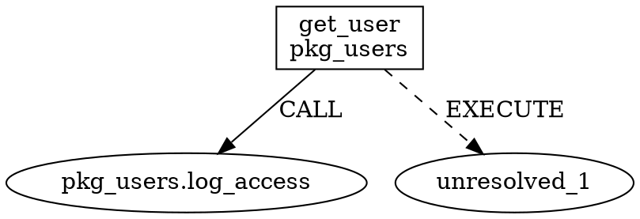
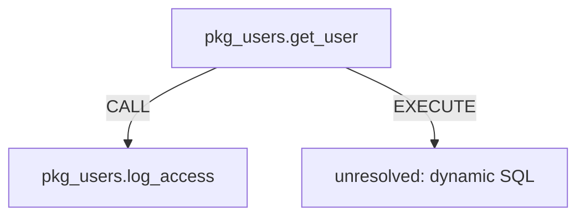

# codeweb 实施路线图

## 项目概述

codeweb 构建跨语言代码调用图。从 SQL 存储过程调用关系起步，逐步扩展到 Java Web 项目的完整调用链：Java 方法 → iBatis XML Mapper → SQL 语句 → 存储过程。

---

## Phase 1: SQL 存储过程调用图

**目标**：解析 GaussDB SQL 文件，提取存储过程间的调用关系，生成有向图并支持可视化导出。

**工期**：3-5 天
**交付价值**：纯 SQL 项目的存储过程调用分析

### 1.1 依赖条件

- [x] ogsql-parser Visitor 增强已完成（commit `8405b1a`）
  - ✅ `visit_pl_block`、`visit_pl_statement`、`visit_pl_declaration`、`visit_pl_exception_handler`
  - ✅ `walk_pl_block`、`walk_pl_statement`、`walk_pl_declaration`
  - ✅ `visit_call`、`visit_procedure_call`
  - ✅ `walk_statement` 对 6 个 PL/pgSQL 载体变体的显式处理
  - ✅ `walk_expr`、`walk_select`、`walk_table_ref` 覆盖率增强

### 1.2 模块设计

```
src/
├── main.rs              # CLI 入口
├── parser/              # SQL 解析层
│   ├── mod.rs           # 公共 API
│   ├── extractor.rs     # 调用关系提取器（Visitor 实现）
│   └── loader.rs        # 文件/目录加载
├── graph/               # 图模型层
│   ├── mod.rs           # 图类型定义
│   ├── builder.rs       # 图构建器
│   └── query.rs         # 基础查询（ callers / callees ）
├── export/              # 导出层
│   ├── mod.rs
│   ├── dot.rs           # Graphviz DOT 格式
│   ├── json.rs          # JSON 序列化
│   └── mermaid.rs       # Mermaid 流程图
└── error.rs             # 统一错误类型
```

### 1.3 核心实现步骤

#### Step 1: 调用关系提取器（1-2 天）

实现 `CallExtractor`（`Visitor` trait）：

```rust
struct CallExtractor {
    current_procedure: Option<ProcedureId>,
    edges: Vec<CallEdge>,
}

struct CallEdge {
    caller: ProcedureId,      // schema.name
    callee: CalleeTarget,     // ProcedureId | Unresolved(String)
    kind: CallKind,           // Static | Dynamic | Unresolved
    location: SourceLocation,
}
```

遍历策略：
1. 遇到 `Statement::CreateProcedure` → 记录当前过程名
2. 遇到 `Statement::Call` → 记录 `func_name` 为被调用者
3. 遇到 `PlStatement::ProcedureCall` → 记录 `name` 为被调用者
4. 遇到 `PlStatement::Execute` → 若 `parsed_query` 存在则递归解析；否则标记为 `Dynamic`
5. 遇到 `Expr::FunctionCall` → 记录为函数调用边（可选，视需求）

**验收标准**：
- [ ] 能解析 `CREATE PROCEDURE` 并提取过程名
- [ ] 能识别 `CALL proc_name()` 和 `EXECUTE 'CALL proc_name()'`
- [ ] 能处理 schema-qualified 名称（`schema.proc`）
- [ ] 动态 SQL 标记为 `Unresolved` 而非静默丢弃

#### Step 2: 图模型与构建器（1 天）

使用 `petgraph::DiGraph`：

```rust
pub type CodeGraph = DiGraph<Node, Edge>;

pub enum Node {
    Procedure {
        id: ProcedureId,          // (schema, name)
        source_file: PathBuf,
        line: usize,
        parameters: Vec<String>,
    },
    Unresolved {
        raw_expr: String,
        context: ProcedureId,
    },
}

pub struct Edge {
    kind: EdgeKind,               // DirectCall | DynamicCall | FunctionCall
    location: SourceLocation,
}
```

图构建器职责：
- 去重：相同 `(schema, name)` 的过程只创建一次节点
- 边合并：同一对 caller→callee 的多次调用合并为单条边（保留所有 location）
- 孤儿节点处理：被调用但未定义的过程创建 `Unresolved` 节点

**验收标准**：
- [ ] 100 个过程的图构建时间 < 100ms
- [ ] 内存占用 < 10MB（千级节点规模）
- [ ] 支持从文件路径和行号定位到源代码

#### Step 3: 导出模块（1-2 天）

**DOT 格式**（Graphviz）：


**JSON 格式**：
```json
{
  "nodes": [
    {"id": "pkg_users.get_user", "schema": "pkg_users", "name": "get_user", "file": "...", "line": 10}
  ],
  "edges": [
    {"from": "pkg_users.get_user", "to": "pkg_users.log_access", "kind": "DirectCall"}
  ]
}
```

**Mermaid 格式**：


**验收标准**：
- [ ] DOT 文件可被 `dot -Tsvg` 渲染
- [ ] JSON 可被 jq 处理，schema 稳定
- [ ] Mermaid 可在 GitHub/GitLab markdown 中直接渲染

#### Step 4: CLI 集成（0.5-1 天）

```bash
codeweb analyze <file_or_dir> --format dot|json|mermaid --output <path>
```

参数：
- `--dialect gaussdb`（默认，未来可扩展）
- `--include-unresolved`（是否包含动态 SQL 边）
- `--max-depth N`（递归调用链深度限制）

**验收标准**：
- [ ] 单文件分析：`codeweb analyze proc.sql --format dot`
- [ ] 目录批量分析：`codeweb analyze ./sql/ --format json -o graph.json`
- [ ] 错误处理：解析失败的文件记录到 stderr，不中断整体流程

### 1.4 测试策略

| 测试类型 | 内容 |
|---|---|
| 单元测试 | `CallExtractor` 对每个 `Statement`/`PlStatement` 变体的处理 |
| 集成测试 | 完整 pipeline：SQL 文件 → 图 → DOT/JSON/Mermaid |
| 端到端测试 | 真实 GaussDB 项目 SQL 文件（脱敏） |
| 性能测试 | 1000 个过程的图构建时间 |

### 1.5 风险与应对

| 风险 | 影响 | 应对 |
|---|---|---|
| ogsql-parser Visitor 增强延迟 | 阻塞 Phase 1 | 先写自定义遍历器作为 fallback，后续替换 |
| 动态 SQL 过多导致图稀疏 | 分析价值降低 | 标记为 `Unresolved` 并在报告中统计占比 |
| 过程名解析歧义（同名不同 schema） | 错误边 | 节点 ID 使用 `(schema, name)` 二元组 |

---

## Phase 2: + iBatis XML Mapper 链路

**目标**：接入 Java Web 项目的 iBatis/MyBatis XML Mapper，将 `Java DAO 接口 → XML Mapper → SQL → 存储过程` 的链路纳入图中。

**工期**：2-3 天
**交付价值**：Java Web 项目的 SQL 调用追踪（从 XML 到存储过程）
**依赖**：Phase 1 完成

### 2.1 前提条件

- ogsql-parser 已启用 `ibatis` 特性
- 项目目录中包含 `.xml` mapper 文件和 `.sql` 文件

### 2.2 新增模块

```
src/
├── bridge/              # 桥接层（新增）
│   ├── mod.rs
│   ├── mapper.rs        # XML Mapper 解析与关联
│   └── linker.rs        # 节点关联逻辑
├── graph/
│   └── model.rs         # 扩展 Node/Edge 类型
```

### 2.3 核心实现步骤

#### Step 1: XML Mapper 解析（0.5 天）

使用 ogsql-parser 的 `ibatis` API：

```rust
use ogsql_parser::ibatis::{parse_mapper_bytes, ParsedMapper, ParsedStatement};

fn load_mappers(dir: &Path) -> Vec<ParsedMapper> {
    // walkdir 扫描 *.xml 文件
    // 对每个文件调用 parse_mapper_bytes()
}
```

提取关键信息：
- `namespace` → Java 接口 FQN（如 `com.example.dao.UserDao`）
- `id` → 方法名（如 `findById`）
- `parse_result` → SQL AST（含存储过程调用）

**验收标准**：
- [ ] 能解析 `<select>`、`<insert>`、`<update>`、`<delete>`、`<sql>`、`<include>`
- [ ] 动态 SQL（`<if>`、`<where>`、`<foreach>`）被正确展平
- [ ] 解析失败的 mapper 记录错误，不中断流程

#### Step 2: 图模型扩展（0.5 天）

新增节点和边类型：

```rust
pub enum Node {
    // Phase 1 已有
    Procedure { ... },
    Unresolved { ... },
    // Phase 2 新增
    MappedStatement {
        id: String,               // "namespace.id"
        namespace: String,
        statement_id: String,
        kind: StatementKind,      // Select | Insert | Update | Delete
        xml_file: PathBuf,
        line: usize,
    },
    SqlStatement {
        text: String,
        source: SqlSource,        // XmlMapper | JavaInline | SqlFile
        ast: Option<Vec<StatementInfo>>,
    },
}

pub enum Edge {
    // Phase 1 已有
    DirectCall,
    DynamicCall,
    // Phase 2 新增
    MapsToSql,                    // MappedStatement → SqlStatement
    CallsProcedure,               // SqlStatement → Procedure
    ReadsFrom,                    // SqlStatement → Table（可选）
    WritesTo,                     // SqlStatement → Table（可选）
}
```

**验收标准**：
- [ ] 图模型支持混合节点（Procedure + MappedStatement + SqlStatement）
- [ ] 边类型区分调用关系和映射关系

#### Step 3: 链路关联（1 天）

从 `ParsedStatement.parse_result` 提取存储过程调用：

```rust
fn link_mapper_to_procedures(
    mapper: &ParsedMapper,
    graph: &mut CodeGraph,
) -> Result<()> {
    for stmt in &mapper.statements {
        // 1. 创建 MappedStatement 节点
        let mapper_node = graph.add_node(Node::MappedStatement { ... });
        
        // 2. 创建 SqlStatement 节点（从 flat_sql）
        let sql_node = graph.add_node(Node::SqlStatement { ... });
        graph.add_edge(mapper_node, sql_node, Edge::MapsToSql);
        
        // 3. 从 parse_result 的 AST 提取 CALL 语句
        if let Some((statements, _)) = &stmt.parse_result {
            for s in statements {
                extract_calls_from_statement(s, sql_node, graph)?;
            }
        }
    }
}
```

**验收标准**：
- [ ] `MappedStatement` 节点正确关联到 `SqlStatement`
- [ ] `SqlStatement` 中的 `CALL proc_name()` 正确关联到 `Procedure` 节点
- [ ] 同名的存储过程调用合并到同一节点

#### Step 4: 导出增强（0.5 天）

DOT 格式中区分节点形状：
- `Procedure` → box
- `MappedStatement` → cylinder（数据库形状）
- `SqlStatement` → ellipse
- `Unresolved` → dashed box

**验收标准**：
- [ ] 导出图能清晰展示 `Mapper → SQL → Procedure` 三层结构
- [ ] Mermaid 支持不同节点形状（Mermaid 限制下用文本标注区分）

### 2.4 CLI 扩展

```bash
# 分析包含 SQL 文件和 XML mapper 的目录
codeweb analyze ./project/ --format dot --include-xml

# 仅分析 XML mapper
codeweb analyze ./mappers/ --format json --source xml
```

### 2.5 测试策略

| 测试类型 | 内容 |
|---|---|
| 单元测试 | `ParsedMapper` → `Node::MappedStatement` 转换 |
| 集成测试 | XML 文件 → 图 → 导出 |
| 端到端测试 | 真实 MyBatis 项目 mapper 文件（脱敏） |

---

## Phase 3: + Java 方法调用 + Java↔Mapper 桥接

**目标**：解析 Java 源代码，提取方法调用关系，并将 Java 方法与 XML Mapper 关联，形成完整的 `Java → Mapper → SQL → Procedure` 调用链。

**工期**：4-6 天
**交付价值**：端到端的 Java Web 项目调用链分析
**依赖**：Phase 2 完成

### 3.1 前提条件

- ogsql-parser 已启用 `java` 特性
- 项目目录中包含 `.java` 源文件、`.xml` mapper 文件和 `.sql` 文件

### 3.2 新增模块

```
src/
├── java/                # Java 解析层（新增）
│   ├── mod.rs
│   ├── extractor.rs     # Java 方法/调用提取（tree-sitter-java）
│   ├── hierarchy.rs     # 类层次结构（extends/implements）
│   └── bridge.rs        # Java ↔ Mapper 关联
├── graph/
│   └── model.rs         # 扩展 Node/Edge 类型
```

### 3.3 核心实现步骤

#### Step 1: Java 方法提取（1-2 天）

使用 `tree-sitter-java`（ogsql-parser 已依赖）：

```rust
use tree_sitter::{Parser, Query, QueryCursor};

struct JavaExtractor;

impl JavaExtractor {
    fn extract_methods(source: &str) -> Vec<JavaMethod> {
        // tree-sitter query:
        // (class_declaration
        //   name: (identifier) @class
        //   body: (class_body
        //     (method_declaration
        //       name: (identifier) @method) @decl))
    }
    
    fn extract_calls(source: &str) -> Vec<MethodCall> {
        // tree-sitter query:
        // (method_invocation
        //   object: (identifier)? @obj
        //   name: (identifier) @method) @call
    }
}

struct JavaMethod {
    class: String,            // "com.example.service.UserService"
    name: String,             // "getUser"
    signature: String,        // "getUser(int)"
    file: PathBuf,
    line: usize,
    body_range: Range,
}

struct MethodCall {
    caller: MethodRef,        // 调用者方法
    callee: Callee,           // 被调用者
    line: usize,
}

enum Callee {
    Qualified { obj: String, method: String },  // "userDao.findById"
    Unqualified(String),                        // "helperMethod"
    Static(String),                             // "Utils.format"
}
```

**关键决策**：不追求完整类型解析（需要 JVM/jdtls），采用**语法级提取 + 启发式关联**：

| 调用形式 | 处理策略 |
|---|---|
| `this.method()` | 关联到当前类的方法 |
| `obj.method()` | 记录为 `obj.method`，后续通过 Mapper 桥接解析 |
| `Class.staticMethod()` | 记录为 `Class.staticMethod` |
| `method()`（无限定） | 优先在当前类查找，否则标记为未解析 |

**验收标准**：
- [ ] 能提取类声明、方法声明、方法调用
- [ ] 能处理构造函数调用 (`new Foo()`)
- [ ] 能提取 `extends` / `implements` 关系
- [ ] 处理 1000 个 Java 文件的时间 < 30 秒

#### Step 2: Java 内嵌 SQL 提取（0.5 天）

复用 ogsql-parser `java` 特性的 `extract_sql_from_java`：

```rust
use ogsql_parser::java::{extract_sql_from_java, JavaExtractConfig};

fn extract_java_sql(file: &Path) -> Vec<ExtractedSql> {
    let source = fs::read_to_string(file).unwrap();
    let config = JavaExtractConfig::default();
    let result = extract_sql_from_java(&source, file.to_str().unwrap(), &config);
    result.extractions
}
```

将 `ExtractedSql` 转换为 `Node::SqlStatement` 并关联到对应的 `JavaMethod`。

**验收标准**：
- [ ] `@Query` 注解中的 SQL 被提取并解析
- [ ] JDBC `prepareStatement`/`executeQuery` 中的 SQL 被提取
- [ ] SQL 变量跨语句追踪（`sql += "..."`）被正确处理

#### Step 3: Java ↔ Mapper 桥接（1-2 天）

**关联规则**：

```rust
fn link_java_to_mapper(
    java_methods: &[JavaMethod],
    mappers: &[ParsedMapper],
    graph: &mut CodeGraph,
) -> Result<()> {
    for method in java_methods {
        // 1. 检查方法是否调用 SqlSession 方法（select/insert/update/delete）
        for call in &method.calls {
            if is_mapper_invocation(call) {
                // 提取 namespace 和 statement id
                // 如: sqlSession.selectList("com.example.dao.UserDao.findById")
                let (namespace, stmt_id) = parse_mapper_ref(call)?;
                
                // 2. 在 graph 中查找对应的 MappedStatement 节点
                if let Some(mapper_node) = find_mapper_node(graph, namespace, stmt_id) {
                    // 3. 创建 JavaMethod 节点并添加 INVOKES_MAPPER 边
                    let java_node = graph.add_node(Node::JavaMethod { ... });
                    graph.add_edge(java_node, mapper_node, Edge::InvokesMapper);
                }
            }
        }
    }
}

fn is_mapper_invocation(call: &MethodCall) -> bool {
    // 检测模式：
    // - sqlSession.select*("namespace.id", ...)
    // - mapper.findById(...) 其中 mapper 是 @Mapper 接口
    // - @Autowired UserDao userDao; userDao.findById(...)
}
```

**Mapper 调用模式识别**：

| 模式 | 示例 | 检测方法 |
|---|---|---|
| SqlSession 直接调用 | `session.selectList("UserDao.findById", id)` | 方法名 `selectList`/`insert`/`update`/`delete` + 第一个参数是字符串字面量 |
| Mapper 接口代理 | `userDao.findById(id)` | 变量类型是接口（通过 `import` 或包名推断）+ 方法名匹配 mapper 的 `id` |
| @Select 注解 | `@Select("SELECT ...")` | 已由 ogsql-parser `java` 特性提取为 `ExtractedSql` |

**验收标准**：
- [ ] `sqlSession.selectList("namespace.id")` 正确关联到 MappedStatement
- [ ] `userDao.findById()` 正确关联到 namespace 为 `UserDao` 的 mapper 中 `id="findById"` 的 statement
- [ ] 未解析的 mapper 引用标记为 `Unresolved` 而非静默丢弃

#### Step 4: 图模型最终扩展（0.5 天）

```rust
pub enum Node {
    // Phase 1-2 已有
    Procedure { ... },
    MappedStatement { ... },
    SqlStatement { ... },
    Unresolved { ... },
    // Phase 3 新增
    JavaMethod {
        fqn: String,              // "com.example.service.UserService.getUser"
        class: String,
        name: String,
        signature: String,
        file: PathBuf,
        line: usize,
    },
    JavaClass {
        fqn: String,
        package: String,
        file: PathBuf,
    },
}

pub enum Edge {
    // Phase 1-2 已有
    DirectCall,
    DynamicCall,
    MapsToSql,
    CallsProcedure,
    // Phase 3 新增
    InvokesMapper,                // JavaMethod → MappedStatement
    CallsJava,                    // JavaMethod → JavaMethod
    ContainsMethod,               // JavaClass → JavaMethod
    Extends,                      // JavaClass → JavaClass
    Implements,                   // JavaClass → JavaClass
}
```

### 3.4 CLI 扩展

```bash
# 分析完整 Java Web 项目
codeweb analyze ./project/ --format dot --full-chain

# 从 Java 方法追溯存储过程
codeweb trace --from "com.example.service.UserService.getUser" --direction forward --depth 5

# 反向：谁调用了这个存储过程？
codeweb trace --from "pkg_users.get_user" --direction backward --depth 5
```

### 3.5 测试策略

| 测试类型 | 内容 |
|---|---|
| 单元测试 | Java AST 查询对每个节点类型的匹配 |
| 集成测试 | Java 文件 → 方法/调用提取 → 图构建 |
| 端到端测试 | 完整项目：Java + XML + SQL → 调用链图 |
| 性能测试 | 1000 个 Java 文件 + 100 个 mapper + 50 个 SQL 文件 |

### 3.6 风险与应对

| 风险 | 影响 | 应对 |
|---|---|---|
| Java 类型解析不准确 | Mapper 桥接错误 | 语法级提取 + 启发式关联，接受一定误报率 |
| MyBatis 注解 vs XML 混合 | 关联遗漏 | 同时处理 `@Select` 注解和 XML mapper |
| 大型项目性能 | 分析时间过长 | 增量分析：只解析变更的文件 |

---

## Phase 4: + 双向图查询 + CLI 完善

**目标**：提供强大的双向查询能力、完善的 CLI 体验和可扩展的架构。

**工期**：3-4 天
**交付价值**：生产可用的代码分析工具
**依赖**：Phase 3 完成

### 4.1 核心实现步骤

#### Step 1: 双向查询引擎（1-2 天）

```rust
pub struct QueryEngine {
    graph: CodeGraph,
    node_index: HashMap<String, NodeIndex>,  // FQN → node index
}

impl QueryEngine {
    /// 向前查询：这个节点调用了什么？
    pub fn callees(&self, node: &Node, depth: usize) -> Vec<CallPath>;
    
    /// 向后查询：谁调用了这个节点？
    pub fn callers(&self, node: &Node, depth: usize) -> Vec<CallPath>;
    
    /// 双向展开：从任意点向两端搜索
    pub fn trace(&self, node: &Node, max_depth: usize) -> SubGraph;
    
    /// 影响分析：修改这个节点会影响哪些入口点？
    pub fn impact(&self, node: &Node) -> Vec<JavaMethod>;
    
    /// 入口点发现：找到所有没有调用者的 Java 方法（API 入口）
    pub fn entry_points(&self) -> Vec<JavaMethod>;
    
    /// 死代码检测：找到所有没有被调用的存储过程
    pub fn dead_code(&self) -> Vec<Procedure>;
}

pub struct CallPath {
    pub path: Vec<Node>,
    pub edges: Vec<Edge>,
}
```

**算法**：
- `callees`：从起点出发的 BFS/DFS，沿出边遍历
- `callers`：反向图上的 BFS/DFS（petgraph 支持 `Reversed` 适配器）
- `trace`：双向 BFS，同时向前和向后展开
- `impact`：从存储过程出发的反向遍历，直到遇到 Java 方法（入口点）

**验收标准**：
- [ ] 千级节点图的查询时间 < 100ms
- [ ] 支持深度限制（避免无限递归）
- [ ] 支持循环调用检测（A→B→C→A）

#### Step 2: 查询 DSL / 过滤（0.5-1 天）

```bash
# 查询特定类型的调用链
codeweb query --from "UserService.getUser" --edge-types "InvokesMapper,CallsProcedure" --depth 3

# 过滤：只显示涉及特定 schema 的调用
codeweb query --from "UserService.getUser" --filter "schema=pkg_users"

# 统计：每个存储过程被多少个 Java 方法调用
codeweb stats --group-by procedure --count callers
```

#### Step 3: 增量分析（0.5 天）

```rust
pub struct IncrementalAnalyzer {
    graph: CodeGraph,
    file_hashes: HashMap<PathBuf, u64>,  // 文件路径 → 内容 hash
}

impl IncrementalAnalyzer {
    pub fn analyze(&mut self, dir: &Path) -> Result<()> {
        for file in walk_dir(dir) {
            let hash = hash_file(&file);
            if self.file_hashes.get(&file) != Some(&hash) {
                // 文件变更：移除旧节点，重新解析并添加新节点
                self.remove_file_nodes(&file);
                self.add_file_nodes(&file);
                self.file_hashes.insert(file, hash);
            }
        }
    }
}
```

**验收标准**：
- [ ] 仅变更的文件被重新解析
- [ ] 增量分析时间 < 全量分析的 10%

#### Step 4: 持久化（0.5 天）

```rust
// 图序列化为 protobuf / JSON
pub fn save_graph(graph: &CodeGraph, path: &Path) -> Result<()>;
pub fn load_graph(path: &Path) -> Result<CodeGraph>;
```

使用 `serde` + `bincode` 或 `protobuf` 格式，支持快速加载。

#### Step 5: CLI 完善（0.5-1 天）

```bash
# 子命令结构
codeweb analyze    # 分析并构建图
codeweb query      # 查询调用链
codeweb trace      # 从指定节点双向追踪
codeweb stats      # 统计报告
codeweb export     # 导出图到各种格式
codeweb serve      # 启动 HTTP API（可选）

# 全局选项
codeweb --config codeweb.toml  # 配置文件支持
codeweb --verbose              # 详细日志
codeweb --cache-dir ./.codeweb # 缓存目录
```

配置文件 `codeweb.toml`：
```toml
[project]
name = "my-project"
source_dirs = ["src/main/java", "src/main/resources/mapper", "db/sql"]

[analysis]
dialect = "gaussdb"
include_unresolved = true
max_depth = 10

[output]
format = "dot"
directory = "./output"
```

### 4.2 导出格式增强

| 格式 | 用途 | 状态 |
|---|---|---|
| DOT | Graphviz 可视化 | Phase 1 |
| JSON | 程序化消费 | Phase 1 |
| Mermaid | Markdown 文档 | Phase 1 |
| CSV | 表格分析 | Phase 4 |
| SARIF | IDE 集成 | Phase 4（可选） |
| Cypher | Neo4j 导入 | Phase 4（可选） |

### 4.3 测试策略

| 测试类型 | 内容 |
|---|---|
| 单元测试 | 查询引擎的每个方法 |
| 集成测试 | 完整 CLI 命令序列 |
| 性能测试 | 大型项目的分析时间和内存占用 |
| 回归测试 | 固定测试项目的输出对比 |

---

## 汇总时间表

| Phase | 内容 | 工期 | 累计 |
|---|---|---|---|
| Phase 1 | SQL 存储过程调用图 | 3-5 天 | 3-5 天 |
| Phase 2 | + iBatis XML Mapper 链路 | 2-3 天 | 5-8 天 |
| Phase 3 | + Java 方法调用 + 桥接 | 4-6 天 | 9-14 天 |
| Phase 4 | + 双向查询 + CLI 完善 | 3-4 天 | 12-18 天 |

**总计**：约 2-3 周（单人全职），或 4-6 周（兼职）。

---

## 关键决策记录

| 决策 | 选择 | 理由 |
|---|---|---|
| 图库 | petgraph | Rust 生态最成熟，无外部依赖，性能足够 |
| Java 解析 | tree-sitter-java | ogsql-parser 已依赖，语法级提取足够 |
| 不引入图数据库 | 否 | Phase 1-4 的节点规模（千级）不需要 |
| 不追求完整类型解析 | 否 | 需要 JVM/jdtls，过重；启发式关联可接受 |
| 动态 SQL 处理 | 标记为 Unresolved | 无法静态解析，但不应丢弃 |
| 增量分析 | Phase 4 实现 | 前期全量分析足够，后期大型项目需要 |
